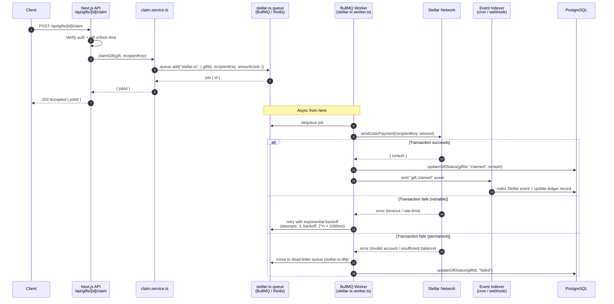

# BullMQ Job Flow: API Request → Stellar Transaction

This document describes the async job pipeline that processes gift claims — from the inbound HTTP request through BullMQ, the Stellar network, and back to the database.

## Sequence Diagram



## Component Responsibilities

| Component | Role |
|---|---|
| `POST /api/gifts/[id]/claim` | Validates auth, checks unlock time, delegates to claim.service |
| `claim.service.ts` | Enqueues the Stellar tx job; does **not** call Stellar directly |
| `stellar-tx.queue` | BullMQ queue backed by Redis; holds pending jobs |
| `stellar-tx.worker.ts` | Picks up jobs, calls Stellar SDK, updates DB on result |
| Stellar Network | Executes the USDC transfer on-chain |
| Event Indexer | Listens for on-chain events; reconciles DB state with ledger |
| `stellar-tx-dlq` | Dead-letter queue for permanently failed jobs |

## Retry & Failure Policy

```
Attempt 1  →  fail  →  wait 1 s  →  retry
Attempt 2  →  fail  →  wait 2 s  →  retry
Attempt 3  →  fail  →  wait 4 s  →  retry
Attempt 4  →  fail  →  dead-letter queue  →  alert + manual review
```

**Dead-letter queue (`stellar-tx-dlq`):** Jobs land here when all retries are exhausted. An alerting integration (e.g. Slack / PagerDuty) should monitor queue depth. Operations can re-enqueue jobs manually after root-cause is resolved.

## Status State Machine

```
pending → processing → claimed
                   ↘ failed (→ dead-letter)
```

Gift row `status` column mirrors job state so the sender dashboard always reflects the latest known state.

## Related Files

- `src/server/services/claim.service.ts` — enqueue entry point
- `src/lib/stellar.ts` — Stellar SDK wrapper (`sendUsdcPayment`)
- `src/server/services/scheduler.service.ts` — cron that triggers unlock checks
- `src/app/api/gifts/` — REST route handlers
